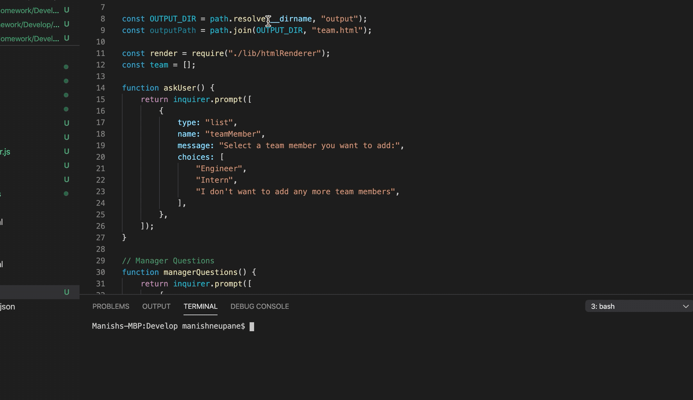

# Assignment10
# Title
Template Engine - Employee Summary

# Content
This assignment is about writing code in node.js to generate team information.

# User story
The app can be use to add any number of team member (engineer or intern in this case) and build a team. The user is prompt with questions about team member which at the end write a html file and render html file with team information. 

# Built with
The application is built using VS Code. The code can be run in terminal using node and also final output can be access in browser.
 
# Video gif of app
;

# repository link of app
(https://github.com/ManNeu/Assignment10)

# Contact
Manish Neupane
email: mrnish.are@gmail.com
phone: 0416508908

# Acknowledgments
Instructor
Teaching assistant 
classmates
